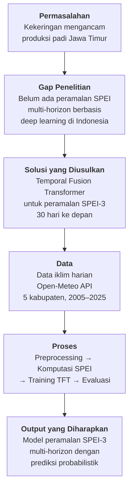
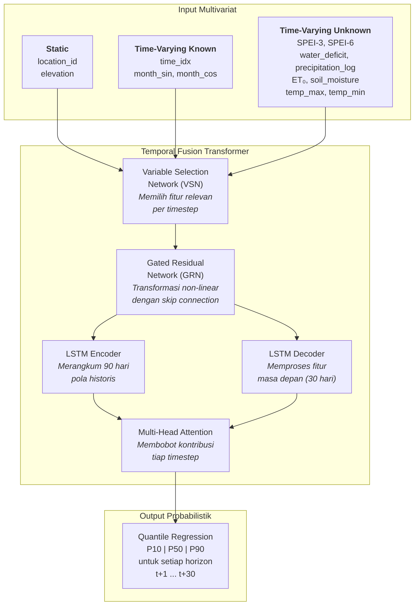
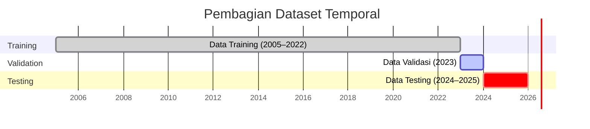
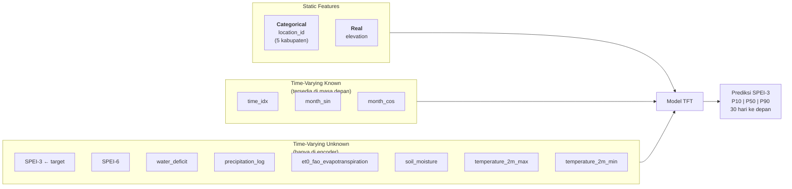
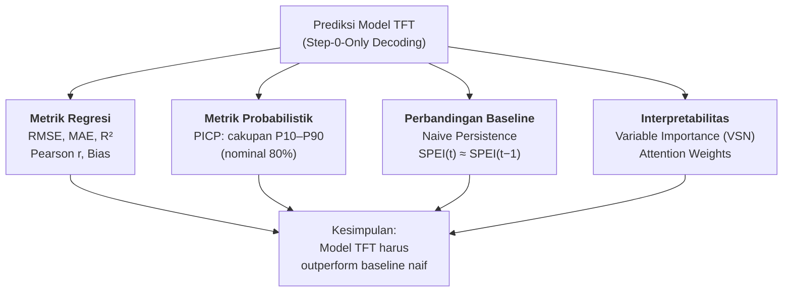

# Panduan Persiapan Seminar Proposal Skripsi

> **Judul:** "Peramalan Multi-Horizon Indeks Kekeringan Lahan Pertanian (SPEI) di Sentra Padi Jawa Timur Menggunakan Temporal Fusion Transformer (TFT)"

---

## 1. Apa Itu Seminar Proposal?

Seminar proposal adalah ujian kelayakan **rencana penelitian** (Bab 1–3). Fokusnya:
- Apakah masalah penelitian jelas dan layak?
- Apakah landasan teori memadai?
- Apakah rancangan metodologi bisa dieksekusi?

**Yang BELUM perlu ada:**
- Hasil eksperimen / akurasi model
- Nilai RMSE, MAE, R², dsb.
- Variabel importance / attention weight aktual
- Analisis hasil dan pembahasan

**Yang HARUS ada:**
- Ide, urgensi, dan gap penelitian
- Teori pendukung metode yang dipilih
- Rancangan alur kerja (metodologi) yang jelas

---

## 2. Struktur Bab 1–3 dan Kedalaman Pembahasan

### Bab 1: Pendahuluan

**Tujuan:** Meyakinkan penguji bahwa masalah ini layak diteliti.

| Sub-bab | Isi | Kedalaman |
|---------|-----|-----------|
| **1.1 Latar Belakang** | Dampak kekeringan terhadap pertanian padi di Jawa Timur; keterbatasan metode konvensional; potensi deep learning (TFT) untuk peramalan SPEI | Naratif 2–3 halaman, didukung data/statistik |
| **1.2 Rumusan Masalah** | Pertanyaan penelitian (bagaimana membangun model TFT untuk meramalkan SPEI-3 multi-horizon 30 hari?) | 2–4 butir pertanyaan |
| **1.3 Tujuan Penelitian** | Membangun dan mengevaluasi model TFT untuk peramalan SPEI-3 di 5 kabupaten sentra padi Jawa Timur | Selaras 1:1 dengan rumusan masalah |
| **1.4 Manfaat Penelitian** | Manfaat akademis (kontribusi literatur) dan praktis (early warning kekeringan) | Ringkas, 1 halaman |
| **1.5 Batasan Masalah** | 5 kabupaten (Bojonegoro, Lamongan, Nganjuk, Ngawi, Tuban); data 2005–2025; horizon 30 hari; SPEI-3 sebagai target utama | Poin-poin jelas |

**Kedalaman algoritma di Bab 1:** Cukup *sebut nama* TFT sebagai solusi yang diusulkan, tanpa detail arsitektur.

---

### Bab 2: Tinjauan Pustaka

**Tujuan:** Membangun fondasi teori dan menunjukkan gap penelitian.

| Sub-bab | Isi | Kedalaman |
|---------|-----|-----------|
| **2.1 Kekeringan dan Dampaknya** | Definisi kekeringan meteorologis; dampak pada produksi padi; konteks Jawa Timur | Deskriptif, 1–2 halaman |
| **2.2 Indeks Kekeringan SPEI** | Konsep SPEI (Standardized Precipitation-Evapotranspiration Index); perbedaan dengan SPI; skala temporal (SPEI-3, SPEI-6); distribusi Log-Logistic; klasifikasi 9 kelas WMO | Teori cukup mendalam (rumus, tabel klasifikasi) |
| **2.3 Time Series Forecasting** | Evolusi metode: statistik klasik (ARIMA) → machine learning → deep learning (RNN, LSTM, Transformer) | Ringkasan evolusi, bukan tutorial |
| **2.4 Temporal Fusion Transformer (TFT)** | Arsitektur TFT: Variable Selection Network, Gated Residual Network, LSTM Encoder-Decoder, Multi-Head Attention, Quantile Regression | Jelaskan *konsep* tiap komponen dan mengapa cocok untuk masalah ini |
| **2.5 Penelitian Terdahulu** | Tabel perbandingan 5–10 paper terkait (SPEI forecasting, TFT applications) dengan kolom: penulis, tahun, metode, data, hasil, kelebihan/kekurangan | Tabel + narasi gap |
| **2.6 Kerangka Pemikiran** | Diagram alur logis: masalah → teori → metode → rencana solusi | 1 diagram + narasi pendek |

**Kedalaman algoritma di Bab 2:** Jelaskan *konsep dan teori* TFT (apa itu VSN, GRN, attention, quantile loss), tetapi belum perlu detail implementasi (kode, hyperparameter spesifik).

---

### Bab 3: Metodologi Penelitian

**Tujuan:** Merancang langkah-langkah eksekusi penelitian secara rinci.

| Sub-bab | Isi | Kedalaman |
|---------|-----|-----------|
| **3.1 Jenis Penelitian** | Penelitian kuantitatif eksperimental | 1 paragraf |
| **3.2 Sumber dan Jenis Data** | Open-Meteo Archive API; data iklim harian; 5 kabupaten; periode 2005–2025 | Tabel variabel yang akan digunakan |
| **3.3 Preprocessing Data** | Interpolasi, transformasi logaritmik presipitasi, encoding fitur temporal (month_sin/cos) | Alur langkah, belum perlu kode |
| **3.4 Komputasi SPEI** | Defisit air (P−ET₀), rolling window, fitting distribusi Log-Logistic, standardisasi → SPEI-3 & SPEI-6 | Rumus + flowchart proses |
| **3.5 Pembagian Dataset** | Train (<2023), Validation (2023), Test (≥2024); scaler fit hanya pada training | Diagram split timeline |
| **3.6 Rancangan Model TFT** | Konfigurasi input: static, time-varying known, time-varying unknown; encoder/decoder window; quantile output | Tabel konfigurasi fitur |
| **3.7 Rencana Training** | Loss function (Quantile Loss), optimizer, early stopping, rencana hyperparameter tuning | Deskripsi rencana, bukan hasil |
| **3.8 Rencana Evaluasi** | Metrik: RMSE, MAE, R², Pearson r, Bias, PICP; baseline naive persistence; step-0-only decoding | Definisi rumus tiap metrik |
| **3.9 Perangkat Penelitian** | Hardware (GPU RTX 3050) dan software (Python, PyTorch, pytorch-forecasting, Lightning) | Tabel spesifikasi |
| **3.10 Jadwal Penelitian** | Gantt chart / timeline rencana pelaksanaan | Tabel/diagram |

**Kedalaman algoritma di Bab 3:** Jelaskan *rancangan* arsitektur dan alur kerja secara detail (diagram, tabel konfigurasi fitur, rumus metrik), tetapi hasilnya belum ada. Boleh menyebut *rencana* hyperparameter awal, bukan hasil tuning.

---

## 3. Key Points / Informasi Wajib untuk Seminar Proposal

### A. Informasi Inti yang Harus Disiapkan

| No | Key Point | Status |
|----|-----------|--------|
| 1 | **Urgensi masalah**: Mengapa peramalan kekeringan penting untuk pertanian padi Jawa Timur? | Wajib |
| 2 | **Gap penelitian**: Apa yang belum terjawab oleh studi sebelumnya? (misal: belum ada TFT untuk SPEI multi-horizon di Indonesia) | Wajib |
| 3 | **Mengapa TFT?** Keunggulan TFT vs metode lain (interpretable, multi-horizon, quantile output, attention mechanism) | Wajib |
| 4 | **Mengapa SPEI?** Keunggulan SPEI vs SPI (memperhitungkan evapotranspirasi) | Wajib |
| 5 | **Sumber data**: Open-Meteo Archive API, variabel apa saja, periode berapa | Wajib |
| 6 | **Lokasi studi**: 5 kabupaten sentra padi Jawa Timur (Bojonegoro, Lamongan, Nganjuk, Ngawi, Tuban) + justifikasi pemilihan | Wajib |
| 7 | **Alur metodologi**: Dari akuisisi data → preprocessing → SPEI → dataset → model → evaluasi | Wajib |
| 8 | **Rancangan arsitektur model**: Layout fitur (static/known/unknown), encoder-decoder window | Wajib |
| 9 | **Rencana evaluasi**: Metrik apa yang digunakan dan mengapa | Wajib |
| 10 | **Jadwal penelitian**: Timeline pelaksanaan (Gantt chart) | Wajib |

### B. Informasi yang TIDAK Perlu di Seminar Proposal

| Tidak Perlu | Alasan |
|-------------|--------|
| Nilai akurasi (RMSE, MAE, R²) | Belum ada eksperimen |
| Hasil variable importance | Belum training model |
| Grafik prediksi vs aktual | Belum ada prediksi |
| Hyperparameter final | Masih rencana, belum tuning |
| Analisis per-lokasi | Masih rencana evaluasi |

---

## 4. Diagram yang Diperlukan untuk Seminar Proposal

Berikut diagram-diagram yang **sebaiknya ada** di seminar proposal, diselaraskan dengan penelitian ini:

---

### Diagram 1: Kerangka Pemikiran



---

### Diagram 2: Alur Metodologi Penelitian

```mermaid
flowchart TD
    subgraph "Tahap 1: Pengumpulan Data"
        A1["Akuisisi data iklim harian<br/>dari Open-Meteo Archive API<br/>(2005–2025)"]
        A2["Variabel: presipitasi, ET₀,<br/>kelembaban tanah, suhu maks/min,<br/>elevasi"]
    end

    subgraph "Tahap 2: Preprocessing"
        B1["Interpolasi linier per lokasi"]
        B2["Transformasi log presipitasi"]
        B3["Encoding fitur temporal<br/>(month_sin, month_cos)"]
    end

    subgraph "Tahap 3: Komputasi SPEI"
        C1["Hitung defisit air<br/>(Presipitasi − ET₀)"]
        C2["Rolling window<br/>90 hari (SPEI-3) / 180 hari (SPEI-6)"]
        C3["Fitting distribusi Log-Logistic"]
        C4["Standardisasi Z-score<br/>→ SPEI-3, SPEI-6"]
    end

    subgraph "Tahap 4: Pembentukan Dataset"
        D1["TimeSeriesDataSet<br/>Encoder: 90 hari<br/>Decoder: 30 hari"]
        D2["Split: Train < 2023<br/>Val = 2023 | Test ≥ 2024"]
    end

    subgraph "Tahap 5: Perancangan & Training Model TFT"
        E1["Konfigurasi arsitektur TFT<br/>(VSN, GRN, LSTM, Attention)"]
        E2["Training dengan Quantile Loss<br/>Early stopping, gradient clipping"]
    end

    subgraph "Tahap 6: Evaluasi"
        F1["Metrik: RMSE, MAE, R²,<br/>Pearson r, Bias, PICP"]
        F2["Baseline: Naive persistence"]
        F3["Analisis per lokasi &<br/>interpretabilitas model"]
    end

    A1 --> A2 --> B1 --> B2 --> B3 --> C1 --> C2 --> C3 --> C4 --> D1 --> D2 --> E1 --> E2 --> F1 --> F2 --> F3
```



---

### Diagram 3: Arsitektur Temporal Fusion Transformer (Konseptual)



---

### Diagram 4: Pembagian Dataset (Timeline)



---

### Diagram 5: Layout Fitur TimeSeriesDataSet



---

### Diagram 6: Encoder-Decoder Window

```
    ◄──────── Encoder (90 hari) ────────►◄──── Decoder (30 hari) ────►
    ┌──┬──┬──┬─────────────────┬──┬──┬──┐┌──┬──┬──┬──────────┬──┬──┐
    │t-89│t-88│...              │t-1│ t₀ ││t+1│t+2│...        │t+29│t+30│
    └──┴──┴──┴─────────────────┴──┴──┴──┘└──┴──┴──┴──────────┴──┴──┘
    │                                    ││                            │
    │  Semua fitur tersedia              ││  Hanya time-varying known  │
    │  (static + known + unknown)        ││  (time_idx, month_sin/cos) │
    └────────────────────────────────────┘└────────────────────────────┘
```

---

### Diagram 7: Rencana Evaluasi



---

### Diagram 8: Peta Lokasi Studi (Deskriptif)

```
                    JAWA TIMUR — 5 Kabupaten Sentra Padi
    ┌─────────────────────────────────────────────────────────┐
    │                                                         │
    │         ★ Ngawi          ★ Tuban                        │
    │                                                         │
    │              ★ Nganjuk        ★ Lamongan                │
    │                                                         │
    │                    ★ Bojonegoro                          │
    │                                                         │
    │   Justifikasi: 5 kabupaten penghasil padi terbesar      │
    │   di Jawa Timur (data BPS)                              │
    └─────────────────────────────────────────────────────────┘
```

---

## 5. Tabel Pendukung untuk Seminar Proposal

### Tabel A: Klasifikasi SPEI (9 Kelas WMO)

| Kategori | Rentang SPEI | Deskripsi |
|----------|-------------|-----------|
| Ekstrem Basah | SPEI ≥ 2.0 | Kondisi sangat basah |
| Parah Basah | 1.5 ≤ SPEI < 2.0 | Basah signifikan |
| Sedang Basah | 1.0 ≤ SPEI < 1.5 | Basah moderat |
| Ringan Basah | 0.5 ≤ SPEI < 1.0 | Sedikit basah |
| Normal | -0.5 < SPEI < 0.5 | Kondisi normal |
| Ringan Kering | -1.0 < SPEI ≤ -0.5 | Sedikit kering |
| Sedang Kering | -1.5 < SPEI ≤ -1.0 | Kering moderat |
| Parah Kering | -2.0 < SPEI ≤ -1.5 | Kering signifikan |
| Ekstrem Kering | SPEI ≤ -2.0 | Kondisi sangat kering |

### Tabel B: Variabel Input Penelitian

| Variabel | Tipe | Sumber | Peran di Model |
|----------|------|--------|----------------|
| SPEI-3 | Time-varying unknown | Dihitung dari data iklim | **Target utama** |
| SPEI-6 | Time-varying unknown | Dihitung dari data iklim | Fitur pendukung |
| precipitation_log | Time-varying unknown | Open-Meteo API | Curah hujan (log-transformed) |
| et0_fao_evapotranspiration | Time-varying unknown | Open-Meteo API | Evapotranspirasi potensial |
| soil_moisture | Time-varying unknown | Open-Meteo API | Kelembaban tanah |
| temperature_2m_max | Time-varying unknown | Open-Meteo API | Suhu maksimum |
| temperature_2m_min | Time-varying unknown | Open-Meteo API | Suhu minimum |
| water_deficit | Time-varying unknown | Dihitung (P − ET₀) | Defisit air |
| time_idx | Time-varying known | Generated | Indeks waktu |
| month_sin | Time-varying known | Derived from date | Encoding musiman |
| month_cos | Time-varying known | Derived from date | Encoding musiman |
| location_id | Static categorical | Assigned | Identitas lokasi |
| elevation | Static real | Open-Meteo API | Ketinggian lokasi |

### Tabel C: Perbandingan Penelitian Terdahulu (Template)

| No | Penulis (Tahun) | Metode | Target | Lokasi | Horizon | Hasil Utama | Gap |
|----|----------------|--------|--------|--------|---------|-------------|-----|
| 1 | ... | ARIMA | SPI | ... | ... | ... | Tidak multi-horizon |
| 2 | ... | LSTM | SPEI | ... | ... | ... | Tidak interpretable |
| 3 | ... | TFT | ... | ... | ... | ... | Bukan untuk SPEI/Indonesia |
| ... | | | | | | | |

*→ Isi dengan paper relevan dari literature review*

### Tabel D: Rencana Metrik Evaluasi

| Metrik | Formula | Tujuan |
|--------|---------|--------|
| RMSE | $\sqrt{\frac{1}{n}\sum(y_i - \hat{y}_i)^2}$ | Mengukur rata-rata kesalahan (sensitif terhadap outlier) |
| MAE | $\frac{1}{n}\sum\|y_i - \hat{y}_i\|$ | Mengukur rata-rata kesalahan absolut |
| R² | $1 - \frac{\sum(y_i - \hat{y}_i)^2}{\sum(y_i - \bar{y})^2}$ | Proporsi variansi yang dijelaskan model |
| Pearson r | $\frac{\text{cov}(y, \hat{y})}{\sigma_y \cdot \sigma_{\hat{y}}}$ | Korelasi linear aktual vs prediksi |
| Bias | $\frac{1}{n}\sum(\hat{y}_i - y_i)$ | Rata-rata over/under-prediction |
| PICP | $\frac{1}{n}\sum \mathbb{1}(y_i \in [P_{10}, P_{90}])$ | Cakupan interval prediksi (target ≈ 80%) |

### Tabel E: Perangkat Penelitian

| Kategori | Spesifikasi |
|----------|-------------|
| **Hardware** | GPU NVIDIA RTX 3050 |
| **Bahasa** | Python 3.x |
| **Framework DL** | PyTorch + pytorch-forecasting |
| **Training** | Lightning (PyTorch Lightning) |
| **Data API** | Open-Meteo Archive API |
| **Komputasi SPEI** | SciPy (distribusi Log-Logistic / fisk) |
| **Data Processing** | Pandas, NumPy |
| **Visualisasi** | Matplotlib |

---

## 6. Tips Presentasi Seminar Proposal

1. **Slide 1–2:** Judul, nama, dosen pembimbing
2. **Slide 3–4:** Latar belakang + urgensi (gunakan data BPS produksi padi, statistik kekeringan)
3. **Slide 5:** Rumusan masalah & tujuan (poin-poin)
4. **Slide 6–7:** Tinjauan pustaka ringkas (apa itu SPEI? apa itu TFT?)
5. **Slide 8:** Tabel penelitian terdahulu + gap
6. **Slide 9:** Kerangka pemikiran (Diagram 1)
7. **Slide 10–12:** Metodologi (Diagram 2 + Diagram 3 arsitektur TFT)
8. **Slide 13:** Layout fitur (Diagram 5) + split data (Diagram 4)
9. **Slide 14:** Rencana evaluasi (Diagram 7) + metrik (Tabel D)
10. **Slide 15:** Jadwal penelitian (Gantt chart)
11. **Slide terakhir:** Penutup + daftar pustaka

**Durasi:** ±15 menit presentasi + tanya jawab

---

## 7. Kemungkinan Pertanyaan Penguji

| Pertanyaan | Poin Jawaban |
|------------|-------------|
| Mengapa TFT, bukan LSTM/ARIMA biasa? | TFT interpretable (VSN + attention), native multi-horizon, output probabilistik (quantile) |
| Mengapa SPEI dan bukan SPI? | SPEI memperhitungkan evapotranspirasi, lebih representatif untuk kondisi aktual lahan pertanian |
| Mengapa 5 kabupaten ini? | Sentra padi terbesar Jawa Timur berdasarkan data BPS |
| Mengapa horizon 30 hari? | Rentang waktu yang cukup untuk early warning sebelum masa tanam/panen |
| Data dari mana? | Open-Meteo Archive API (gratis, resolusi harian, data reanalysis ERA5) |
| Apa baseline-nya? | Naive persistence (SPEI hari ini = SPEI kemarin) |
| Bagaimana menghindari data leakage? | Strict temporal split: train <2023, val 2023, test ≥2024; scaler fit hanya pada training |
| Distribusi apa untuk SPEI? | Log-Logistic (scipy.stats.fisk), kalibrasi per bulan kalender |
