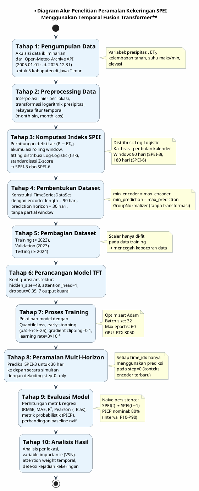
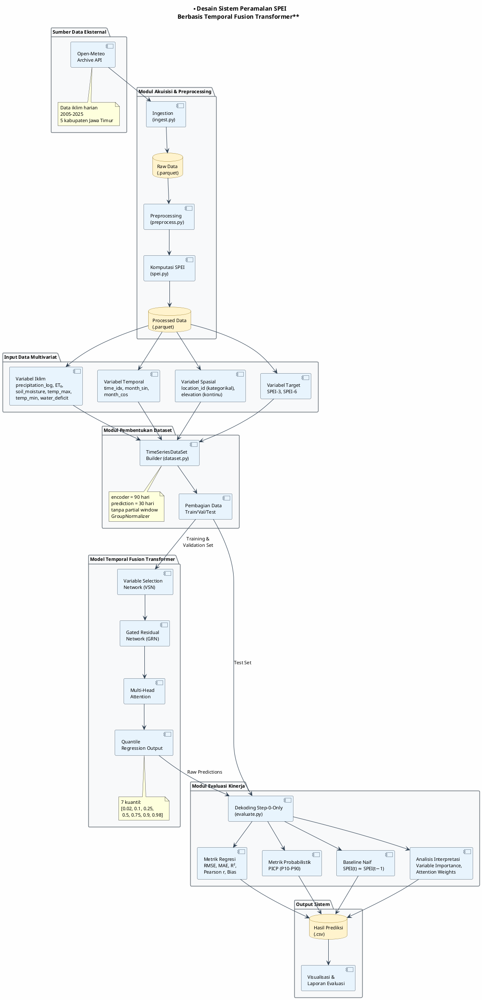
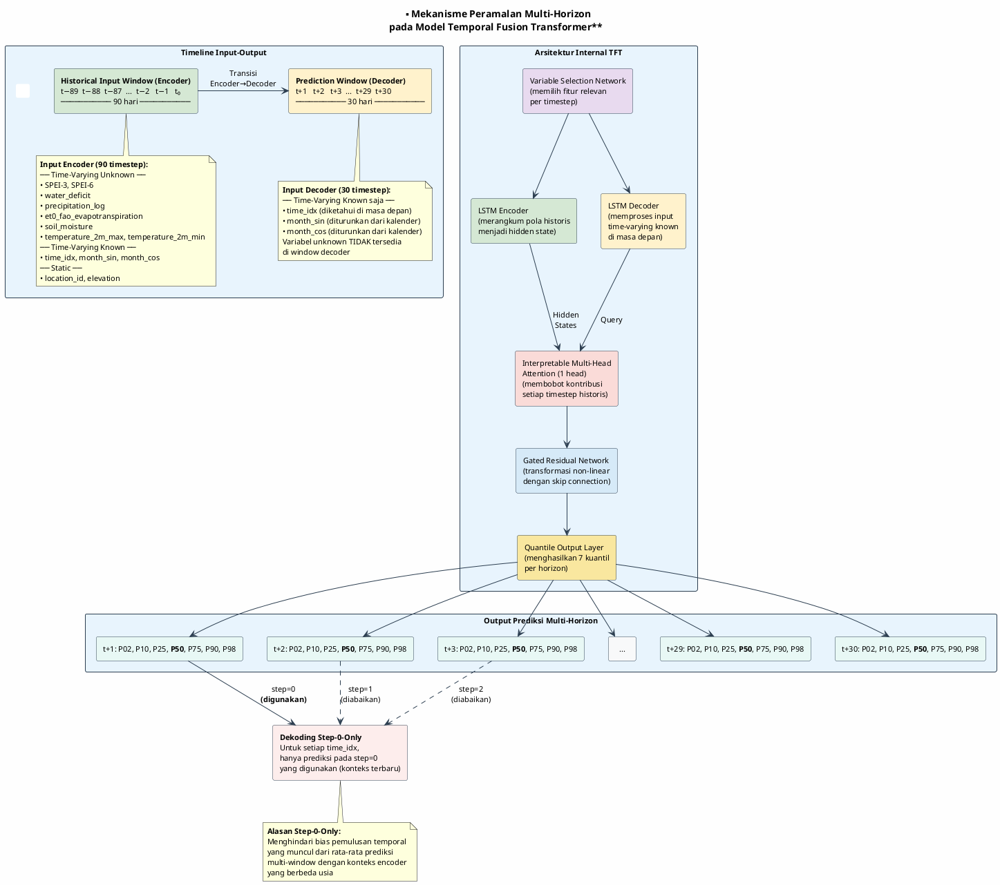
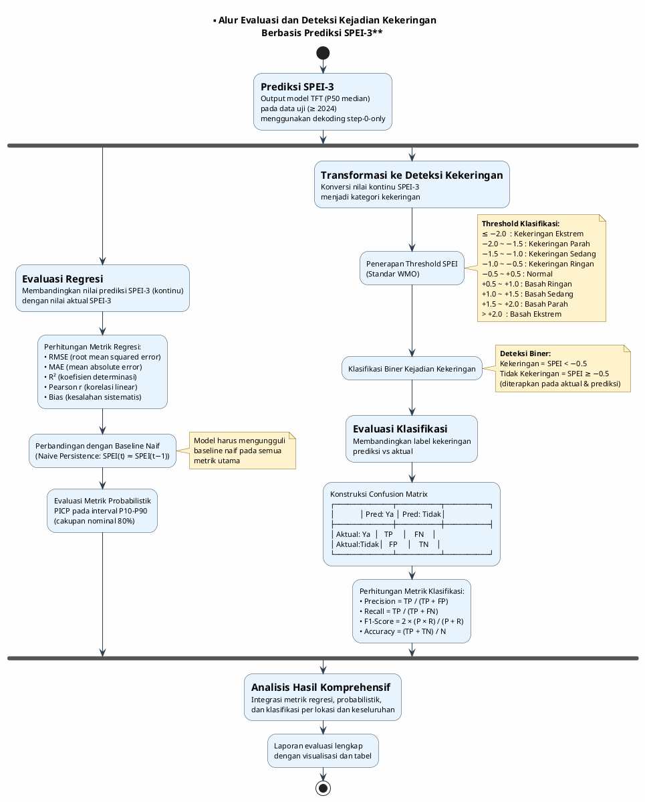

# Diagram dan Tabel Penelitian
## Sistem Peramalan Kekeringan Berbasis SPEI Menggunakan Temporal Fusion Transformer

---

# Bagian 1: Diagram (PlantUML)

---

## 1. Diagram Alur Penelitian



---

## 2. Diagram Desain Sistem Peramalan SPEI Berbasis TFT



---

## 3. Diagram Mekanisme Peramalan Multi-Horizon pada Model TFT



---

## 4. Diagram Proses Evaluasi Prediksi Probabilistik (PICP)

```plantuml
@startuml
skinparam backgroundColor #FEFEFE
skinparam defaultFontName Arial
skinparam defaultFontSize 11
skinparam activityBackgroundColor #E8F4FD
skinparam activityBorderColor #2C3E50
skinparam arrowColor #2C3E50

title **Proses Evaluasi Prediksi Probabilistik\nPrediction Interval Coverage Probability (PICP)**

start

:== **Input: Raw Prediction dari Model TFT**
Model menghasilkan 7 output kuantil
per timestep per lokasi:
[P02, P10, P25, P50, P75, P90, P98];
note right
  QuantileLoss dengan kuantil:
  [0.02, 0.1, 0.25, 0.5, 0.75, 0.9, 0.98]
  P50 = prediksi median (titik)
end note

:== **Dekoding Step-0-Only**
Untuk setiap time_idx, ambil HANYA
prediksi pada forecast step=0
(konteks encoder paling mutakhir);

:== **Ekstraksi Interval Prediksi**
Batas bawah: P10 (kuantil ke-10)
Batas atas: P90 (kuantil ke-90)
→ interval prediksi 80%;

:== **Pencocokan dengan Nilai Aktual**
Untuk setiap sampel i,
periksa apakah:
  P10ᵢ ≤ yᵢ ≤ P90ᵢ;

if (yᵢ berada dalam interval [P10, P90]?) then (ya)
  :Sampel tercakup (covered)
  in_interval = 1;
else (tidak)
  :Sampel tidak tercakup
  in_interval = 0;
endif

:== **Perhitungan PICP**
PICP = Σ(in_interval) / n
dimana n = jumlah total sampel;
note right
  PICP dihitung secara:
  • Keseluruhan (overall)
  • Per lokasi (5 kabupaten)
end note

if (PICP ≈ 0.80?) then (ya, terkalibrasi)
  :Model terkalibrasi dengan baik
  Interval prediksi sesuai
  dengan cakupan nominal;
  #palegreen
elseif (PICP < 0.80?) then (under-coverage)
  :Interval terlalu sempit
  Model terlalu percaya diri
  (overconfident);
  #lightyellow
else (PICP > 0.80, over-coverage)
  :Interval terlalu lebar
  Model terlalu konservatif;
  #lightyellow
endif

:== **Pelaporan**
Tabel PICP overall dan per lokasi
disertakan dalam hasil evaluasi;

stop

@enduml
```

---

## 5. Diagram Alur Evaluasi dan Deteksi Kejadian Kekeringan



---

# Bagian 2: Tabel Penelitian

---

## Tabel 1. Variabel Dataset Penelitian

| No | Nama Variabel | Jenis Variabel | Deskripsi | Sumber Data |
|----|---------------|----------------|-----------|-------------|
| 1 | SPEI-3 | Target / Unknown | Standardized Precipitation-Evapotranspiration Index skala 3 bulan (rolling window 90 hari), dihitung menggunakan distribusi Log-Logistic | Dihitung dari data Open-Meteo |
| 2 | SPEI-6 | Unknown | Standardized Precipitation-Evapotranspiration Index skala 6 bulan (rolling window 180 hari) | Dihitung dari data Open-Meteo |
| 3 | `precipitation_log` | Iklim / Unknown | Transformasi logaritmik presipitasi harian: log(1 + precipitation_sum) dalam satuan mm | Open-Meteo Archive API |
| 4 | `et0_fao_evapotranspiration` | Iklim / Unknown | Evapotranspirasi referensi harian berdasarkan persamaan FAO Penman-Monteith (mm) | Open-Meteo Archive API |
| 5 | `water_deficit` | Iklim / Unknown | Defisit air harian: presipitasi dikurangi evapotranspirasi referensi (P − ET₀) dalam mm | Dihitung dari data Open-Meteo |
| 6 | `soil_moisture` | Iklim / Unknown | Rata-rata kelembaban tanah harian pada kedalaman 0–7 cm (m³/m³) | Open-Meteo Archive API |
| 7 | `temperature_2m_max` | Iklim / Unknown | Suhu udara maksimum harian pada ketinggian 2 meter (°C) | Open-Meteo Archive API |
| 8 | `temperature_2m_min` | Iklim / Unknown | Suhu udara minimum harian pada ketinggian 2 meter (°C) | Open-Meteo Archive API |
| 9 | `time_idx` | Temporal / Known | Indeks waktu berupa jumlah hari sejak awal dataset, digunakan sebagai referensi sekuensial | Dihitung dari kolom waktu |
| 10 | `month_sin` | Temporal / Known | Komponen sinus dari encoding siklus bulanan: sin(2π × bulan / 12) | Dihitung dari kolom waktu |
| 11 | `month_cos` | Temporal / Known | Komponen kosinus dari encoding siklus bulanan: cos(2π × bulan / 12) | Dihitung dari kolom waktu |
| 12 | `location_id` | Spasial / Statis | Identifikator kategorikal kabupaten (Bojonegoro, Lamongan, Nganjuk, Ngawi, Tuban) | Didefinisikan manual |
| 13 | `elevation` | Spasial / Statis | Ketinggian lokasi di atas permukaan laut (m), konstan per lokasi | Open-Meteo Archive API |

---

## Tabel 2. Klasifikasi Variabel pada Model Temporal Fusion Transformer

| No | Nama Variabel | Kategori Variabel | Penjelasan |
|----|---------------|-------------------|------------|
| 1 | `location_id` | Static Categorical | Identifikator lokasi kabupaten yang bersifat tetap sepanjang waktu. Memungkinkan model mempelajari pola spasial spesifik untuk masing-masing dari 5 kabupaten. |
| 2 | `elevation` | Static Real | Ketinggian lokasi (m) yang konstan per kabupaten. Memberikan konteks geografis statis yang memengaruhi pola iklim lokal. |
| 3 | `time_idx` | Time-Varying Known Real | Indeks waktu sekuensial (hari) yang diketahui untuk masa depan. Memungkinkan model memahami posisi temporal absolut. |
| 4 | `month_sin` | Time-Varying Known Real | Komponen sinus dari encoding siklus bulanan. Bersama `month_cos`, menangkap pola musiman secara kontinu tanpa diskontinuitas. Dapat dihitung untuk masa depan. |
| 5 | `month_cos` | Time-Varying Known Real | Komponen kosinus dari encoding siklus bulanan. Melengkapi `month_sin` untuk representasi siklus musiman yang lengkap. |
| 6 | SPEI-3 | Time-Varying Unknown Real | Variabel target utama. Hanya tersedia pada window encoder (historis); model harus memprediksinya untuk window decoder (masa depan). |
| 7 | SPEI-6 | Time-Varying Unknown Real | Indeks kekeringan skala lebih panjang sebagai fitur pendukung. Memberikan konteks tren kekeringan jangka menengah. |
| 8 | `water_deficit` | Time-Varying Unknown Real | Defisit air harian (P − ET₀). Merupakan komponen fundamental dalam perhitungan SPEI dan indikator langsung keseimbangan air. |
| 9 | `precipitation_log` | Time-Varying Unknown Real | Presipitasi harian setelah transformasi logaritmik. Mengurangi skewness distribusi presipitasi yang sangat miring ke kanan. |
| 10 | `et0_fao_evapotranspiration` | Time-Varying Unknown Real | Evapotranspirasi referensi FAO. Merepresentasikan permintaan atmosfer terhadap air, dipengaruhi oleh radiasi dan suhu. |
| 11 | `soil_moisture` | Time-Varying Unknown Real | Kelembaban tanah permukaan. Indikator kondisi hidrologi aktual yang merespons presipitasi dan evaporasi. |
| 12 | `temperature_2m_max` | Time-Varying Unknown Real | Suhu udara maksimum harian. Memengaruhi laju evapotranspirasi dan intensitas kekeringan meteorologis. |
| 13 | `temperature_2m_min` | Time-Varying Unknown Real | Suhu udara minimum harian. Memberikan informasi rentang suhu diurnal yang relevan terhadap proses hidrologi. |

---

## Tabel 3. Konfigurasi Parameter Model Temporal Fusion Transformer

| No | Parameter | Nilai | Deskripsi |
|----|-----------|-------|-----------|
| 1 | Encoder Length | 90 hari | Panjang window historis yang digunakan sebagai input. Disesuaikan dengan window akumulasi SPEI-3 (3 × 30 hari). |
| 2 | Prediction Horizon | 30 hari | Jumlah langkah waktu ke depan yang diprediksi secara simultan oleh model. |
| 3 | Hidden Size | 48 unit | Dimensi representasi laten pada setiap lapisan. Dikurangi dari standar 64/128 untuk mencegah overfitting pada dataset 5 lokasi. |
| 4 | Attention Heads | 1 head | Jumlah head pada mekanisme multi-head attention. Satu head memadai untuk skala dataset yang relatif kecil. |
| 5 | Dropout | 0.35 | Probabilitas dropout untuk regularisasi stokastik. Ditingkatkan dari standar 0.1–0.3 untuk pengendalian overfitting yang lebih kuat. |
| 6 | Hidden Continuous Size | 8 unit | Dimensi representasi untuk variabel kontinu sebelum diproses oleh GRN. |
| 7 | Output Quantiles | 7 kuantil | Kuantil output: [0.02, 0.1, 0.25, 0.5, 0.75, 0.9, 0.98]. P50 (median) digunakan sebagai prediksi titik utama. |
| 8 | Loss Function | QuantileLoss | Fungsi kerugian regresi kuantil yang mengoptimalkan seluruh 7 kuantil secara bersamaan. |
| 9 | Learning Rate | 3 × 10⁻⁴ | Laju pembelajaran awal untuk optimizer Adam. |
| 10 | Weight Decay | 1 × 10⁻⁴ | Regularisasi L2 untuk mencegah bobot model terlalu besar. |
| 11 | Batch Size (Train) | 32 | Ukuran mini-batch selama pelatihan. |
| 12 | Batch Size (Val/Test) | 64 | Ukuran mini-batch selama validasi dan pengujian (lebih besar karena tidak perlu backpropagation). |
| 13 | Max Epochs | 60 | Batas maksimum jumlah epoch pelatihan. |
| 14 | Early Stopping Patience | 25 epoch | Jumlah epoch tanpa perbaikan validation loss sebelum pelatihan dihentikan secara otomatis. |
| 15 | Early Stopping Min Delta | 1 × 10⁻⁴ | Perubahan minimum pada validation loss yang dianggap sebagai perbaikan signifikan. |
| 16 | Gradient Clipping | 0.1 | Nilai maksimum norma gradien untuk mencegah exploding gradient. |
| 17 | Precision | float32 | Presisi aritmatika selama pelatihan. |
| 18 | Reduce LR Patience | 3 epoch | Jumlah epoch tanpa perbaikan sebelum learning rate diturunkan secara otomatis. |
| 19 | Optimizer | Adam | Algoritma optimisasi adaptif dengan momentum. |
| 20 | Accelerator | GPU (RTX 3050) | Perangkat komputasi yang digunakan untuk pelatihan. |

---

## Tabel 4. Pembagian Dataset Penelitian

| Subset Data | Periode Waktu | Durasi | Jumlah Sampel (± per lokasi) | Total Sampel (5 lokasi) | Tujuan Penggunaan |
|-------------|---------------|--------|------------------------------|------------------------|-------------------|
| Training | 1 Januari 2005 – 31 Desember 2022 | ± 18 tahun | ± 6.380 sekuens | ± 31.900 sekuens | Pelatihan model dan fitting scaler (GroupNormalizer). Scaler difit secara eksklusif pada subset ini untuk mencegah kebocoran data. |
| Validation | 1 Januari 2023 – 31 Desember 2023 | 1 tahun | ± 365 sekuens | ± 1.825 sekuens | Pemantauan overfitting selama pelatihan, penghentian dini (early stopping), dan penyesuaian learning rate. Menggunakan scaler dari data training. |
| Testing | 1 Januari 2024 – 31 Desember 2025 | ± 2 tahun | ± 730 sekuens | ± 3.650 sekuens | Evaluasi akhir model pada data yang tidak pernah dilihat selama pelatihan maupun validasi. Menggunakan scaler dari data training. |

**Catatan:**
- Pembagian dilakukan secara temporal-kronologis (bukan acak) untuk mencerminkan skenario peramalan dunia nyata.
- Tidak terdapat tumpang tindih antar subset: tahun < 2023 (training), tahun = 2023 (validation), tahun ≥ 2024 (testing).
- Jumlah sekuens valid memperhitungkan kebutuhan encoder (90 hari) dan prediction horizon (30 hari), sehingga lebih kecil dari jumlah hari mentah.

---

## Tabel 5. Metrik Evaluasi Kinerja Model (Regresi)

| No | Metrik | Rumus | Tujuan Penggunaan |
|----|--------|-------|-------------------|
| 1 | RMSE (Root Mean Squared Error) | $\text{RMSE} = \sqrt{\frac{1}{n}\sum_{i=1}^{n}(y_i - \hat{y}_i)^2}$ | Mengukur besaran kesalahan prediksi secara keseluruhan dengan penalti lebih besar terhadap kesalahan besar. Satuan sama dengan variabel target (dimensionless untuk SPEI). |
| 2 | MAE (Mean Absolute Error) | $\text{MAE} = \frac{1}{n}\sum_{i=1}^{n}\|y_i - \hat{y}_i\|$ | Mengukur rata-rata kesalahan absolut prediksi. Lebih robust terhadap outlier dibandingkan RMSE. |
| 3 | R² (Koefisien Determinasi) | $R^2 = 1 - \frac{\sum_{i=1}^{n}(y_i - \hat{y}_i)^2}{\sum_{i=1}^{n}(y_i - \bar{y})^2}$ | Mengukur proporsi variansi data aktual yang dapat dijelaskan oleh model. Nilai 1.0 menunjukkan prediksi sempurna; nilai negatif menunjukkan model lebih buruk dari rata-rata. |
| 4 | Pearson r (Korelasi Pearson) | $r = \frac{\sum(y_i - \bar{y})(\hat{y}_i - \bar{\hat{y}})}{\sqrt{\sum(y_i - \bar{y})^2 \cdot \sum(\hat{y}_i - \bar{\hat{y}})^2}}$ | Mengukur kekuatan dan arah hubungan linear antara nilai aktual dan prediksi. Nilai mendekati 1.0 menunjukkan korelasi linear positif sempurna. |
| 5 | Bias | $\text{Bias} = \frac{1}{n}\sum_{i=1}^{n}(\hat{y}_i - y_i)$ | Mengukur kesalahan sistematis model. Nilai positif menunjukkan prediksi cenderung terlalu tinggi (overestimate); nilai negatif menunjukkan underestimate. |
| 6 | PICP (Prediction Interval Coverage Probability) | $\text{PICP} = \frac{\#\{y_i \in [P10_i,\, P90_i]\}}{n}$ | Mengukur proporsi observasi aktual yang berada dalam interval prediksi P10–P90 (cakupan nominal 80%). Mengevaluasi kalibrasi ketidakpastian model. |

---

## Tabel 6. Metrik Evaluasi Deteksi Kejadian Kekeringan (Klasifikasi)

| No | Metrik | Deskripsi | Interpretasi |
|----|--------|-----------|--------------|
| 1 | Precision | Proporsi prediksi kekeringan positif yang benar-benar merupakan kejadian kekeringan aktual. Dihitung sebagai TP / (TP + FP). | Nilai tinggi menunjukkan rendahnya alarm palsu (*false alarm*). Precision tinggi penting untuk menghindari pemborosan sumber daya mitigasi akibat peringatan yang tidak tepat. |
| 2 | Recall (Sensitivity) | Proporsi kejadian kekeringan aktual yang berhasil dideteksi oleh model. Dihitung sebagai TP / (TP + FN). | Nilai tinggi menunjukkan model mampu menangkap sebagian besar kejadian kekeringan. Recall tinggi krusial untuk sistem peringatan dini agar tidak melewatkan kejadian kekeringan. |
| 3 | F1-Score | Rata-rata harmonik antara precision dan recall: 2 × (P × R) / (P + R). | Memberikan ukuran keseimbangan antara precision dan recall dalam satu metrik tunggal. Nilai mendekati 1.0 menunjukkan keseimbangan optimal antara deteksi kekeringan dan minimisasi alarm palsu. |
| 4 | Confusion Matrix | Tabel kontingensi 2×2 yang menampilkan distribusi True Positive (TP), True Negative (TN), False Positive (FP), dan False Negative (FN). | Memberikan gambaran lengkap kinerja klasifikasi biner. TP = kekeringan terdeteksi benar; TN = non-kekeringan terdeteksi benar; FP = alarm palsu; FN = kekeringan tidak terdeteksi. Threshold kekeringan: SPEI < −0.5. |

**Catatan:**
- Klasifikasi biner menggunakan threshold SPEI = −0.5 berdasarkan standar WMO: nilai SPEI < −0.5 dikategorikan sebagai kejadian kekeringan, dan SPEI ≥ −0.5 sebagai kondisi non-kekeringan.
- Metrik dihitung pada data uji (tahun ≥ 2024) secara keseluruhan maupun per lokasi.
- Dalam konteks sistem peringatan dini kekeringan, recall umumnya diprioritaskan di atas precision karena kegagalan mendeteksi kekeringan (FN) berpotensi menimbulkan kerugian pertanian yang lebih besar dibandingkan alarm palsu (FP).
